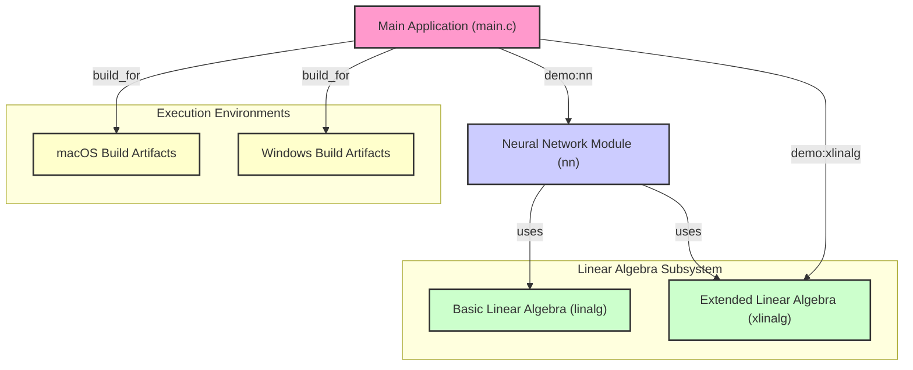

# Welcom to `c-nn`!
This is a repository made just for fun. I came up with the idea of realizing some basic linear algebra calculations using C and probably may be able to build a neural network out of the foundation.



Compile:

Windows:
```bash
gcc -o ./exec_win/main main.c linalg.c xlinalg.c nn.c -lm
```

Mac:
```bash
gcc -o ./exec_macos/main main.c linalg.c xlinalg.c nn.c -lm
```

---

## Run `main.c` (Take macOS as an example)

Run demo of `xlinalg`:

```zsh
./exec_macos/main -demo xlinalg    
```

Run demo of `nn`:

```zsh
./exec_macos/main -demo nn    
```
